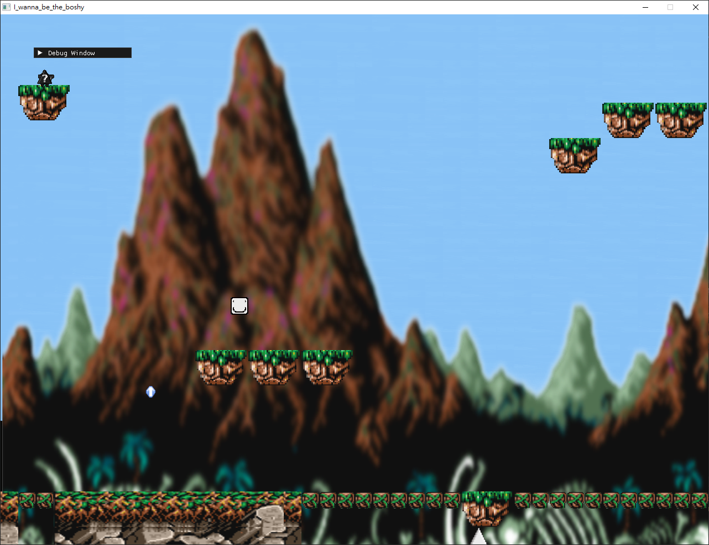

# 2025 OOPL Final Report

## 組別資訊

組別：35
組員：112590011 林維信 112590044 邱翊豪
復刻遊戲：I Wanna Be The Boshy

## 專案簡介
本專案為 2025 年 NTUT《物件導向程式設計》期末報告，目標為復刻經典遊戲《I Wanna Be The Boshy》的部分功能，包括：

- 玩家控制（移動、跳躍、死亡重生）
- 基本平台與陷阱機制
- 儲存點設置與回溯機制
- Debug Mode：顯示遊戲內物件座標,作弊模式等等
- 記憶體管理與資源釋放（避免 Memory Leak）
### 遊戲簡介
《I Wanna Be The Boshy》是一款高難度平台跳躍遊戲，由玩家操控角色「Boshy」挑戰重重關卡與陷阱。遊戲特色包括大量突發陷阱、精準跳躍操作、多樣化 Boss 戰與懷舊遊戲致敬元素，是經典的自虐型遊戲代表作之一。
### 組別分工
| 112590011 | 林維信 |50%|負責素材製作 主functions編寫
| 112590044 | 邱翊豪 |50%|debug主functions 副functions編寫

## 遊戲介紹
本專案為復刻高難度平台跳躍遊戲《I Wanna Be The Boshy》，玩家需操控主角在充滿陷阱與障礙的關卡中存活並前進。遊戲講求操作精準度與反應速度，強調挑戰性與過關成就感。關卡中設有儲存點，玩家失敗後可即時重生，反覆嘗試直到成功。遊戲亦融入經典遊戲角色與元素，提升趣味性與懷舊感。

### 遊戲規則
玩家使用鍵盤上下左右,z,x,r操作主角進行移動與跳躍。
上下左右  移動
z  跳躍
x  射擊
r  重生到存檔點

關卡中充滿即死陷阱（如尖刺、落石、隱藏機關），碰到即死亡並回到最近的儲存點。

玩家可透過射擊儲存點來保存進度。

遊戲目標為避開陷阱並通過所有平台與障礙物，成功到達終點。

無限制重試次數，鼓勵玩家反覆挑戰直到成功。
### 遊戲畫面

## 程式設計

### 程式架構
#### 🧩 關鍵類別架構與系統說明

| 🗂️ 系統分類       | 🔧 主要類別                                                                 | 📄 標頭檔案位置                                   |
|------------------|----------------------------------------------------------------------------|--------------------------------------------------|
| **核心系統 (App Core)**   | `App`, `App::GamePhase`, `App::State`                                 | `App.hpp`                                         |
| **玩家系統 (Player System)** | `Character`, `AnimatedCharacter`                                       | `Character.hpp`, `AnimatedCharacter.hpp`         |
| **敵人系統 (Enemy System)** | `bear`, `spider`, `Bird`                                                | `bear.hpp`, `MapObject/spider.hpp`, `MapObject/bird.hpp` |
| **Boss 系統 (Boss System)** | `Boss1`, `BulletTypeA/B/C`, `LightAttack`                              | `Boss1/*.hpp`                                     |
| **地圖系統 (Map System)**   | `MapInfoLoader`, `World`                                               | `MapInfoLoader.hpp`, `World.hpp`                 |
| **地圖物件 (Map Objects)**  | `CheckPoint`, `Platform`, `FallingGround`, `JumpBoost`                | `MapObject/*.hpp`                                 |
| **資源管理系統 (Resource System)** | `ResourceManager`, `BgmManager`                                 | `ResourceManager.hpp`, `BgmManager.hpp`          |

#### 項目文件總覽 📋

#### 📁 項目文件組織

| 🔍 類別 | 📄 檔案位置 | 🛠️ 功能說明 |
|:--------:|:------------|:------------|
| 🚀 **主入口** | `src/main.cpp` | 應用程式入口點和主遊戲迴圈 |
| 🧠 **核心遊戲邏輯** | `src/App.cpp` `src/AppStart.cpp` `src/AppUpdate.cpp` | 主遊戲應用流程控制 |
| 💾 **資源管理** | `src/ResourceManager.cpp` `include/ResourceManager.hpp` | 加載和管理遊戲資源 |
| 👤 **角色系統** | `src/Character.cpp` `src/AnimatedCharacter.cpp` | 玩家角色實現 |
| 👾 **敵人系統** | `src/enemy.cpp` `src/Bird.cpp` | 敵人行為和互動 |
| 🗺️ **地圖系統** | `src/MapInfoLoader.cpp` `include/MapObject/*.hpp` | 地圖加載和與地圖物件的互動 |
| 🎮 **遊戲物件** | `include/Bullet.hpp` `src/bullet.cpp`, etc. | 各種遊戲物件實現 |
| 📱 **UI系統** | `src/Menu.cpp` `include/Menu.hpp` | 菜單和用戶界面元素 |
| ⚙️ **建置配置** | `CMakeLists.txt` `files.cmake` | 項目建置設置和文件組織 |
### 程式技術

在本專案中，我們實作了多項與物件導向設計、遊戲邏輯與圖像渲染有關的技術，包含以下幾點：

- **物件導向設計（OOP）**  
  遊戲中的玩家、敵人、地圖與各種物件皆以類別方式封裝，並透過繼承與多型實現如 `AnimatedCharacter` 繼承 `Character`，不同敵人如 `bear`, `spider`, `Bird` 等皆為獨立實例，具備自訂的行為與狀態機制。

- **事件驅動與狀態機設計**  
  使用 `App::GamePhase` 與 `App::State` 管理遊戲狀態（如主選單、過關、失敗等），並依據玩家行為與遊戲內物件觸發事件，例如：觸碰陷阱觸發死亡重生邏輯、擊中儲存點觸發儲存。

- **圖像與動畫處理**  
  透過自訂的 `Animation` 類別與多幀圖像切換系統，實現角色與敵人的動畫效果。Boss 攻擊使用 `LightAttack` 等特殊動畫特效結合攻擊判定，提升視覺張力。

- **碰撞判定與物理控制**  
  基本平台、尖刺、落石等皆透過 tilemap 編號進行碰撞判定，角色跳躍與移動行為使用加速度與重力模擬，並限制最多一次跳躍機會，避免空中連跳 BUG。

- **記憶體管理與資源重用**  
  使用 `shared_ptr` 與 `ResourceManager` 管理圖像與音樂資源，避免重複載入與記憶體洩漏問題。遊戲關閉時確保資源正確釋放，通過多次 Leak 測試。

- **Debug Mode 與除錯工具**  
  提供座標顯示、無敵、瞬間傳送、無限跳等內建 Debug 模式，大幅加速測試流程，特別是高難度場景的反覆測試與陷阱驗證。

- **擴充性設計**  
  各個 `MapObject` 類別如 `CheckPoint`, `FallingGround`, `JumpBoost` 採統一介面設計，日後可輕鬆擴充新型物件，例如時間控制的落石或追蹤型敵人。

# 🧾 結語
## 🛠️ 問題與解決方法

### 🧩 Issue 1：地圖載入系統太複雜  
> 原先試圖設計一個系統，將背景與地圖判定屬性綁定，簡化後續地圖開發。由於需繪製近百張地圖，導致維護困難。

✅ **解決方法**：回歸簡單做法，將每張地圖使用一張 `.png` 圖片搭配 `.txt` 判定組合，明確分離邏輯與視覺層。

---

### 🧩 Issue 2：地圖判定無法統一  
> 缺乏一致的方式來描述地圖內不同物件，導致碰撞與邏輯處理複雜。

✅ **解決方法**：建立明確的 tile 編號對照表：
### 🧩 Issue 3：特殊陷阱製作困難（如 `phase2trap`, `bear`）  
> 需要動態改變地圖或陷阱行為，標準邏輯無法應對。

✅ **解決方法**：  
- 擴充 `MapInfoLoader` 類別，加入 `SetTile()` 方法動態變更地圖內容。  
- 整合 **波形運動計算**，讓陷阱移動更加自然流暢。

---

### 🧩 Issue 4：Boss1 攻擊流程與特效規劃困難  
> Boss 擁有多種攻擊型態，需分開設計流程與特效並串接。

### 🧩 Issue 5：地圖旋轉(工作進度外)時，角色射出的子彈不會跟隨地圖旋轉
✅ **解決方法**：
> 因為是進度外的所以目前未修復
### 自評

| 項次 | 項目                   | 完成 |
|------|------------------------|-------|
| 1    | 這是範例 |  V  |
| 2    | 完成專案權限改為 public |  V  |
| 3    | 具有 debug mode 的功能  |  V  |
| 4    | 解決專案上所有 Memory Leak 的問題  |  V  |
| 5    | 報告中沒有任何錯字，以及沒有任何一項遺漏  |  V  |
| 6    | 報告至少保持基本的美感，人類可讀  |  V  |

### 心得
### 👨‍💻 112590011 林維信

雖然我們在程式碼規劃與物件導向設計方面可能堆出了一座 **屎山**，某種程度上也可說是「白學」了一場，但我們的重心始終放在「**如何更完整地還原原作遊戲體驗**」。

我們從地圖素材製作開始，每張地圖都是透過 **手動截圖、摳圖、整理素材**，再利用 **Tiled** 軟體拼製出完整地圖。整體手工繪製量累積將近 **100 張圖以上**，並且需要額外轉換為 `.txt` 判定檔。

與其他採用現成素材的遊戲專案相比，我們的開發歷程無疑投入了 **更多原創與手工勞力**，這也讓我們更加理解一款遊戲背後所需的努力與細節。

### 👨‍💻 112590044 邱翊豪
在製作這遊戲中遇到了很多問題但最終我們都有想出解決方法，在這過程學到了很多關於物件導向的技巧和知識，除了學習到物件導向我也意識到多人作業的難點和合作，總之這堂課讓我收穫滿滿。

### 貢獻比例

